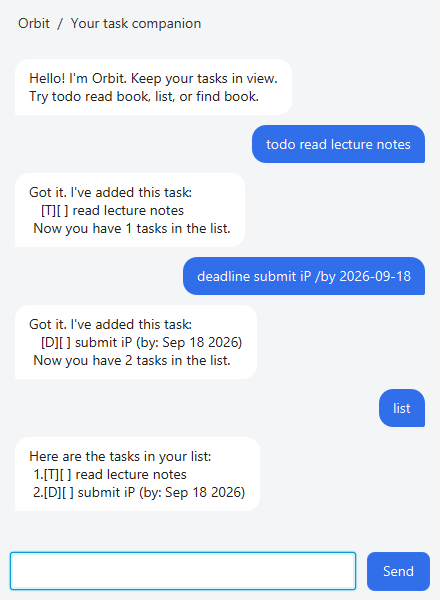

# Orbit

Your task companion for keeping todos, deadlines, and events in view.



## Get started

1. Install Java 25 and check it with `java -version`.
2. Download `orbit.jar` from [the latest release](https://github.com/Elljaykei/ip/releases/latest).
3. Put the JAR in a folder where you have write access. Open a terminal in that folder and run:

   ```text
   java -jar orbit.jar
   ```

Type a command in the input box and press Enter or click Send. Resize the window
as needed; replies wrap to fit. Errors appear in red.

## Commands

Command words ignore case. Leading/trailing whitespace and multiple spaces
between a command and its arguments are accepted. Use lowercase `/by`, `/from`,
and `/to` markers with whitespace around them; each marker must occur only once.
Descriptions and event times cannot be empty. Pipes (`|`) and line breaks are not allowed.

| Command | Example | Result |
| --- | --- | --- |
| `todo DESCRIPTION` | `todo read lecture notes` | Add a task without a date. |
| `deadline DESCRIPTION /by YYYY-MM-DD` | `deadline submit iP /by 2026-09-18` | Add a deadline with a valid calendar date. |
| `event DESCRIPTION /from START /to END` | `event study group /from Fri 2pm /to Fri 3pm` | Add an event; times are stored as text. |
| `list` | `list` | Show tasks and their numbers. |
| `mark NUMBER` | `mark 1` | Mark a task done (`[X]`). |
| `unmark NUMBER` | `unmark 1` | Reopen a task (`[ ]`). |
| `delete NUMBER` | `delete 1` | Remove a task permanently. |
| `find TEXT` | `find lecture` | Show descriptions containing the text, ignoring case. |
| `bye` | `bye` | Close Orbit. |

Use numbers from the full `list` when marking, reopening, or deleting a task.
Search results are numbered within the results, so run `list` before changing a
found task. Task numbers can change after deletion. `list` and `bye` accept no arguments.

Deadline dates use `YYYY-MM-DD`; nonexistent dates such as `2026-02-30` are rejected.
Event times are free text: Orbit does not compare their chronological order or
interpret `2pm` and `14:00` as equivalent. Include dates for events spanning days.

## Duplicate tasks

Orbit rejects a task with the same type and description, ignoring case and
surrounding whitespace. Internal whitespace remains significant. Deadlines must
also share the same date; events must share the same start and end text, ignoring
case and surrounding whitespace. Completed tasks count as duplicates too.
Use `unmark NUMBER` to reopen one, or delete it before adding it again.

## Saved tasks and troubleshooting

Orbit saves changes automatically in `data/orbit.txt`, relative to the folder
from which you launched it. Start it from the same folder each time to reload
your tasks. A missing file means a fresh, empty list. Back up this file before
editing it manually or moving your installation.

If a saved file cannot be read or contains invalid records, Orbit shows a warning
and disables saving to protect the original file. Repair or restore the file and
restart Orbit. Tasks entered while saving is disabled are temporary.

If saving fails during normal use, Orbit reports that changes exist in memory
only. Keep it open, restore write access to the data folder, and perform another
task change to retry saving. Closing before a successful save loses those changes.

If a command is rejected, read the red reply and compare your command with the
examples above. Rejected commands leave your tasks unchanged.

## Credits

Orbit builds on the [SE-EDU Duke project](https://github.com/se-edu/duke) and its
[JavaFX tutorial](https://se-education.org/guides/tutorials/javaFx.html).
Week 6 GUI, error-handling, tests, and documentation were developed with AI assistance.
